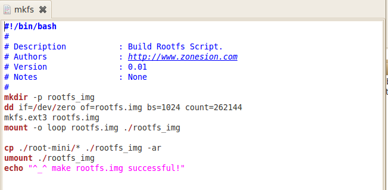
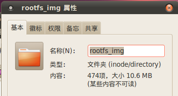
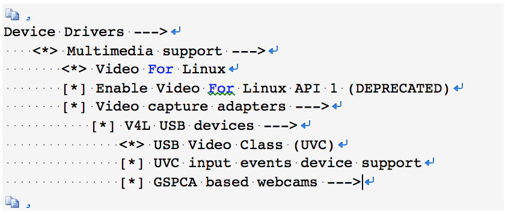

# 2017年《嵌入式操作系统》期末 project 设计报告

### 第一章 项目概述


1. 目标：定制和移植s4418平台上的最小 Linux 内核与文件系统。在最小系统的基础上，加入USB摄像头，用QT编写界面，实现一个利用USB摄像头进行实时监控的简单系统。根据需求，内核需要有基本的功能与 USB 驱动，文件系统也要加上QT环境。
2. 已完成的功能：内核和文件系统可以成功编译制作，安装到s4418平台上后可以正常启动；USB摄像头可以被正常驱动、识别；使用了QT设计GUI，摄像头拍摄到的画面可以成功显示在板子的屏幕上。
3. 测试的效果：插入USB摄像头后，/dev目录下会出现video9设备，UVC 驱动识别到摄像头插入，在终端上显示：uvcvideo: Found UVC 1.00 device (046d:08c5)。通过手动移动摄像头，屏幕上显示的画面也在移动，画面有一定时延，，满足监控需求。

### 第二章 项目人员组成及分工
| 人员 | 分工 | 占比 |
| ----- | ------ | --- | 
| 方铭 | 添加UVC驱动至内核，文件系统移植QT，调试摄像头 | 0% |
| 徐佳豪 |  | 0% | 
| 舒倩 | 最小内核与文件系统的裁剪与编译 | 0% |
| 谢昌秦 | 调试摄像头，QT图形化界面的代码编写与调试 | 0% |
| 卢卓君 |  | 0% |

### 第三章 项目效果


根据图片，可以看出，摄像头拍摄到的图像都显示在了屏幕上；移动的过程中，图像也在跟着移动，实时监控功能已经实现了。为了让屏幕布局更好看，在显示图像的边框右边，加上了一些QT编写的界面，虽然内容比较简单，但也算是完成了图形化界面的设计。对于最小内核的文件系统的裁剪，无法形象的体现出来，只有通过编译后的文件大小来说明。开发板能正常烧写和运行，说明没有裁剪掉实时监控系统所需要的内核模块和系统程序。


### 第四章 项目开发过程


<!--按这个来
http://blog.csdn.net/yin_pengpeng/article/details/62237024-->

1、General setup 
代码成熟度选项，它又有子项：  
1.1、prompt for development and/or incomplete code/drivers  
该选项是对那些还在测试阶段的代码，驱动模块等的支持。一般应该选这个选项，除非你只是想使用 Linux 中已经完全稳定的东西。但这样有时对系统性能影响挺大。 

暂时选
 
1.2、Cross-compiler tool prefix   
交叉编译工具前缀，例如：Cross-compiler tool prefix值为: (arm-Linux-)  

默认不选
 
1.3、Local version - append to kernel release 
内核显示的版本信息，填入 64字符以内的字符串，你在这里填上的字符口串可以用uname -a命令看到。 
默认不选
 
1.4、 Automatically append version information to the version string 
自动在版本字符串后面添加版本信息,编译时需要有perl以及Git仓库支持 

不选
 
1.5、Kernel compression mode (Gzip) ---> 
有四个选项，这个选项是说内核镜像要用的压缩模式，回车一下，可以看到gzip,bzip2,lzma,lxo,一般可以按默认的gzip,如果要用bzip2,lzma,lxo要先装上支持 
默认不选
1.6、Support for paging of anonymous memory (swap) 
 使用交换分区或交换文件来做为虚拟内存，一定要选上。 
默认不选
1.7、System V IPC   
表示系统的进程间通信Inter Process Communication，它用于处理器在程序之间同步和交换信息，如果不选这项，很多程序运行不起来，必选。 
 
1.8、POSIX Message Queues    
POSIX标准的消息队列，它同样是一种IPC。
默认不选
 
1.9、BSD Process Accounting       
用户进程访问内核时将进程信息写入文件中。通常主要包括进程的创建时间/创建者/内存占用等信息。建议最好选上。 
    BSD Process Accounting version 3 file format 
使用新的第三版文件格式,可以包含每个进程的PID和其父进程的PID,但是不兼容老版本的文件格式。 
默认不选
1.10 默认不选

1.11、Export task/process statistics through netlink (EXPERIMENTAL) 
通过netlink接口向用户空间导出任务/进程的统计信息,与BSD Process Accounting的不同之处在于这些统计信息在整个任务/进程生存期都是可用的 
    Enable per-task delay accounting (EXPERIMENTAL)    
    在统计信息中包含进程等候系统资源(cpu,IO同步,内存交换等)所花费的时间 
    Enable extended accounting over taskstats (EXPERIMENTAL) 
    在统计信息中包含扩展进程所花费的时间 
默认不选

 1.12、Auditing support 
审记支持，用于和内核的某些子模块同时工作，例如Security Enhanced linux。只有选择此项及它的子项，才能调用有关审记的系统调用。 

默认选
 
1.13、Enable system-call auditing support 
 支持对系统调用的审计 

默认选

1.14、IRQ subsystem  --->   
中断子系统 
    Support sparse irq numbering   
    <=== 支持稀有的中断编号，关闭

默认不选

1.15、RCU Subsystem  --->    
非对称读写锁系统 是一种高性能的kernel 锁机制，适用于读多写少环境 
RCU Implementation (Tree-based hierarchical RCU)  ---> 
RCU 实现机制 Tree(X) Tree-based hierarchical RCU 基本数按等级划分 
Enable tracing for RCU 
激活跟踪 
(32) Tree-based hierarchical RCU fanout value 
基本数按等级划分分列值 
Disable tree-based hierarchical RCU auto-balancing 
 
默认不选

1.16、< > Kernel .config support 
这个选项允许.config文件（即编译LINUX时的配置文件）保存在内核当中 
不选
 
1.17、(17) Kernel log buffer size (16 => 64KB, 17 => 128KB) 
 
1.18、[ ] Control Group support  --->     
    cgroups 支持， 文档资料 ，cgroups 主要作用是给进程分组，并可以动态调控进程组的CPU 占用率。比如A 进程分到apple 组，给予20%CPU 占用率，E 进程分easy 组，给予50%CPU 占用率，最高100% 。我目前没有此类应用场景，用到时会选择将其编译进去。 
    CPU bandwidth provisioning for FAIR_GROUP_SCHED 
     此选项允许用户定义的CPU带宽速率（限制）在公平的组调度运行的任务。组没有限制设置被认为是无约束和运行没有限制。 
    Group scheduling for SCHED_RR/FIFO 
      此功能可以让您显式地分配真实的CPU带宽任务组。 
 默认选
 
1.19、-*- Namespaces support  --->  
命名空间支持，允许服务器为不同的用户信息提供不 同的用户名空间服务 
    [*]   UTS namespace      
    通用终端系统的命名空间。它允许容器，比如Vservers利用UTS命名空间来为不同的服务器提供不同的UTS。如果不清楚，选N。 
    [*]   IPC namespace   
    IPC命名空间，不确定可以不选 
    [*]   User namespace (EXPERIMENTAL) 
    User命名空间，不确定可以不选 
    [*]   PID Namespaces   
    PID命名空间，不确定可以不选 
    [*]   Network namespace   
 
1.20、Automatic process group scheduling    自动进程组调度 
 
1.21、[ ] enable deprecated sysfs features to support old userspace tools 
 
1.22、-*- Kernel->user space relay support (formerly relayfs)   
在某些文件系统上( 比如debugfs ) 提供从内核空间向用户空间传递大量数据的接口，我目前没有此类应用场景 
 
1.23、   [*] Initial RAM filesystem and RAM disk (initramfs/initrd) support    
用于在真正内核装载前，做一些操作（俗称两阶段启动），比如加载module ，mount 一些非root 分区，提供灾难恢复shell 环境等， 资料 ，我是期望直接从kernel image 直接启动，所以没选它 
 
1.24、Initramfs source file(s)    
initrd已经被initramfs取代,如果你不明白这是什么意思,请保持空白 
 
1.25、Optimize for size 
这个选项将在GCC 命令后用 “-Os ” 代替 “-O2 ″参数，这样可以得到更小的内核。没必要选。选上了有时会产生错误的二进制代码。 
 
1.26、Enable full-sized data structures for core：在内核中使用全尺寸的数据结构.禁用它将使得某些内核的数据结构减小以节约内存,但是将会降低性能。 
 
1.27、Enable futex support：快速用户空间互斥体可以使线程串行化以避免竞态条件,也提高了响应速度.禁用它将导致内核不能正确的运行基于glibc的程序。 
 
1.28、Enable eventpoll support：支持事件轮循的系统调用。 
 
1.29、Use full shmem filesystem：除非你在很少的内存且不使用交换内存时，才不要选择这项。后面的这四项都是在编译时内存中的对齐方式，0 表示 
编译器的默认方式。使用内存对齐能提高程序的运行速度，但是会增加程序对内存的使用量。内核也是一组程序呀。 
    Enable VM event counters for /proc/vmstat：允许在/proc/vmstat中包含虚拟内存事件记数器。 
    [*] Disable heap randomization 
禁用随机heap（heap堆是一个应用层的概念，即堆对CPU是不可见的，它的实现方式有多种，可以由OS实现，也可以由运行库实现,如果你愿意，你也可以在一个栈中来实现一个堆） 
 
1.30、Choose SLAB allocator (SLAB)  ---> 
选择内存分配管理器（强烈推荐使用SLUB） 
 
1.31、[ ] Configure standard kernel features (for small systems)  --->  
这个选项可以让内核的基本选项和设置无效或者扭曲。这是用于特定环境中的，它允许“非标准”内核。你要是选它，你一定要明白自己在干什么。这是为了编译某 些特殊用途的内核使用的，例如引导盘系统。配置标准的内核特性(为小型系统) 
    Enable 16-bit UID system calls：允许对UID系统调用进行过时的16-bit包装。 
    Sysctl syscall support  几乎使用不到这一选项，不选它可以轻微使内核变小 
    Include all symbols in kallsyms：在kallsyms中包含内核知道的所有符号,内核将会增大300K。 
    Enable support for printk：允许内核向终端打印字符信息,在需要诊断内核为什么不能运行时选择。 
    BUG() support：显示故障和失败条件(BUG 和WARN),禁用它将可能导致隐含的错误被忽略。 
    Enable ELF core dumps：内存转储支持,可以帮助调试ELF格式的程序。 
 
1.32、[*] Profiling support 
不选剖面支持，用一个工具来扫描和提供计算机的剖面图。支持系统评测（对于大多数用户来说并不是必须的） 
 
1.33、OProfile system profiling 
OProfile评测和性能监控工具 
 
1.35、[ ]   OProfile multiplexing support (EXPERIMENTAL)   
 
1.34、Kprobes 
调试内核除非开发人员，否则不选 
 
?1.35、Optimize trace point call sites   
 
1.36、GCOV-based kernel profiling  
        [ ] Enable gcov-based kernel profiling 不选 


<!--后面是卢老板抄的-->

1. Linux内核裁剪

    `
    make menuconfig 
    `
    
    使用空格键进行选取。在每一个选项前都有一个括号，有的是中括号有的是尖括号，还有圆括号。用空格键选择时可以发现，中括号里要么是空，要么是"*"，
    而尖括号里可以是空，"*"和"M"这表示前者对应的项要么不要，要么编译到内核里；后者则多一样选择，可以编译成模块。而圆括号的内容是要你在所提供的几个选项中选择一项。

    裁剪掉的部分：
    
##### Gernal Setup

    IRQ subsystem：Support sparse irq numbering (中断子系统中支持稀有的中断编号) 用不上稀有中断，裁剪掉；

    Namespaces support (命名空间支持) 系统不需要使用用户名，所以不需要命名空间服务；

    Kprobes (内核调试) 非开发人员，所以不选

    GCOV-based kernel profiling:Enable gcov-based kernel profiling
    不知道什么意思，所以不选

#####  Enable loadable module support
    Forced module unloading (允许强制卸载正在使用中的模块) 非开发者，所以这个功能不需要

    Support for extended (non-PC) x86 platforms  不涉及系统位数，不选

    RDC R-321x SoC 嵌入式相关，不选 

    Support non-standard 32-bit SMP architectures 非标准的32位SMP结构支持，不选 

    Eurobraille/Iris poweroff module 用于urobraille的iris机子，不选

    Memtest 内核增加一个“memtest”（内核测试）的参数，用不到

    Generic x86 support 针对x86系列的CPU使用更多的常规优化，用不上

    SMT (Hyperthreading) scheduler support 支持Intel的超线程(HT)技术超线程调度器在某些情况下将会对 Intel Pentium 4 HT系列有较好的支持，与实验设备无关，不选

    Multi-core scheduler support 多核优化调度，没什么用途，不选

    Enable X86 board specific fixups for reboot 修复重启bug，现在的板子没有这种问题，不选；

    Math emulation 数学协处理器仿真，CPU够用了，不选；

    Enable seccomp to safely compute untrusted bytecode 嵌入式系统可以不选 

    kexec system call(kexec 系统调用) 用来关闭你当前内核，然后开启另一个内核的系统调用，垃圾功能，不选；

    kernel crash dumps 内核崩溃时，dump运行时信息。看到了运行时信息也不知道怎么解决，所以不选；

    Build a relocatable kernel 建立一个移动的内核，并增加10% 的内核尺寸，运行时会被丢弃，没实质性的作用 

    Compat VDSO support 不选可以移除高阶的VDSO映射，使用随机的VDSO；

    Built-in kernel command line 建立内核命令行，用的是用户层面的命令行，内核的用不上，所以不选；

    Enable CPUfreq debugging 调试CPU频率，没本事改BIOS，所以不选；

    Read CNB20LE Host Bridge Windows 没有公共规范的芯片组，此功能已知是不完整的，要它何用？

    Amateur Radio support 没有用到无线电 

    Wireless， Wireless LAN 实验没有使用无线网卡 

    RF switch subsystem support  没有RF切换设备 

    Managed device resources verbose debug messages 管理设备资源的冗长调试信息，我不需要 

    Ethernet (10000 Mbit)  实验室基金有限，用不起万M卡；  

    FDDI driver support 光纤卡驱动，实验室太穷，用不起光纤；

    Token Ring driver support IBM的令牌环网，用的是以太网(好像根本不用上网)；

    Polled input device skeleton 一种周期性轮询硬件状态的驱动，去掉后没什么副作用  

    Joysticks/Gamepads 游戏设备  

    Miscellaneous devices 杂七杂八的驱动，扬声器，笔记本扩展按键等  

    /dev /kmem virtual device support  支持/dev /kmem 设备，很少用

    Non-standard serial port support  没有非标准的串口设备

    8250/16550 and compatible serial support 兼容一些老式的串口设备，一般不用  

    AMD HW Random Number Generator support, AMD Geode HW Random Number Generator support, VIA HW Random Number Generator support 用的是intel 主板     

    /dev /nvram support  直接存取CMOS ，太危险，关    

    Sound card support 用不到声卡 

    HID Devices  用不到人力工程学设备 

    X86 Platform Specific Device Drivers  一些笔记本的驱动，没有相关设备 

    Remote debugging over FireWire early on boot 启动过程中，允许远程调试内核，用不上这么难的操作

    Security options  安全特性，全关，这些选项不会影响日常开发和办公

    Virtualization 虚拟化，暂时不需要在板子上装虚拟机，不选；

```
$ cd /usr/local/src/s4418/s5p4418-kitkat/kernel
$ export PATH=../uboot/tools:$PATH
$ cp arch/arm/configs/x4418_defconfig .config
$ make menuconfig 
$ make ARCH=arm CROSS_COMPILE= .. /prebuilts/gcc/linux-x86/arm/arm-eabi-4.7/bin/arm-eabi- uImage
```

2. 最小文件系统制作
    ```
    |-- bin  
    |   |-- busybox  
    |   '-- sh -> busybox  
    |-- dev  
    |   '-- console  
    |-- etc  
    |   '-- init.d  
    |       '-- rcS  
    '-- lib  
        |-- ld-2.3.2.so  
        |-- ld-linux.so.2 -> ld-2.3.2.so  
        |-- libc-2.3.2.so  
        '-- libc.so.6 -> libc-2.3.2.so 
    ```
    这个最小根文件系统例子只有5个目录，共8个文件。这个极小的根文件系统可以实现系统引导，并通过串行控制台为用户提供一个功能完整的命令行提示，用户可以使用busybox 中启用的任意命令。

    从/bin目录开始看，在其下面已经有了可执行的busybox文件和指向busybox的软链接（soft link）sh，你一会儿就会明白这样做的必要性。/dev目录下的文件是打开一个控制台进行输入/输出所需要的设备节点（device node） 。/etc/init.d目录下的rcS文件是由busybox启动时处理的默认的初始化脚本文件，尽管该文件并不是必需的。使用rcS文件之后就不会出现busybox发出的警告信息，该警告信息只会在rcS文件缺失的时候才出现。

    上述根文件系统必需的最后一个目录项及两个文件是两个库：GLIBC（libc-2.3.2.so）库和Linux动态加载器（ld-2.3.2.so）。GLIBC包括C标准库函数（如printf()）以及绝大多数应用程序所依赖的其他大量库函数；Linux动态加载器用于将二进制可执行文件加载到内存中，并且执行应用程序引用所需共享库函数的链接工作。这里包括的两个软链接是指向ld-2.3.2.so的ld-linux.so.2和指向libc-2.3.2.so的libc.so.6，这些链接使这些共享库不受版本影响并且具有向后兼容的特性，在所有Linux系统下都能看到这类链接。

    本次实验并不需要用到busybox的所有命令行功能，所以可以根据需求进一步裁剪。

    busybox中，Busybox Settings， Init Utilities，Shells，
    Coreutiles不可裁剪，其余的都可以删掉；同时也可以对Coreutils执行进一步的裁剪。本次实验理论上用不到任何与命令行有关的操作，只需要执行一个编译c++代码后生成的可执行文件就可以了。所以将Coreutiles中所有命令设置为n也可以满足要求。但是为了调试方便，保留了cd和ls的命令。

    最后，再把内核和交叉编译好的QT移植进这个文件系统。

    

    文档和光盘提供的mkfs脚本生成的镜像大小为256MB，共有262144个扇区，每个扇区大小为1024字节。
    

    挂载镜像后，可以看到，其实际大小为10.6MB，因此可以把它大幅缩减为16MB。保持扇区大小不变，修改mkfs脚本，令count=16384，即虚拟镜像文件的存储介质的扇区数为16384个。
    


3. usb摄像头驱动
在裁剪好的linux内核基础上，检查并确保以下模块已经加入。


由于本系统的核心功能是实时监控，UVC驱动是开发板每次启动所必须的，因此把上述模块全部加入内核，开机自动载入内核，而不是以模块方式手动加载。


4. QT界面的编写


### 第五章 项目总结

#### 遇到的问题

#### 未解决的问题

#### 完善项目建议

