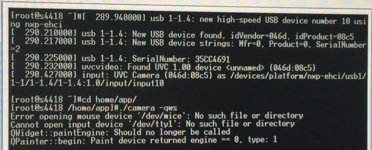
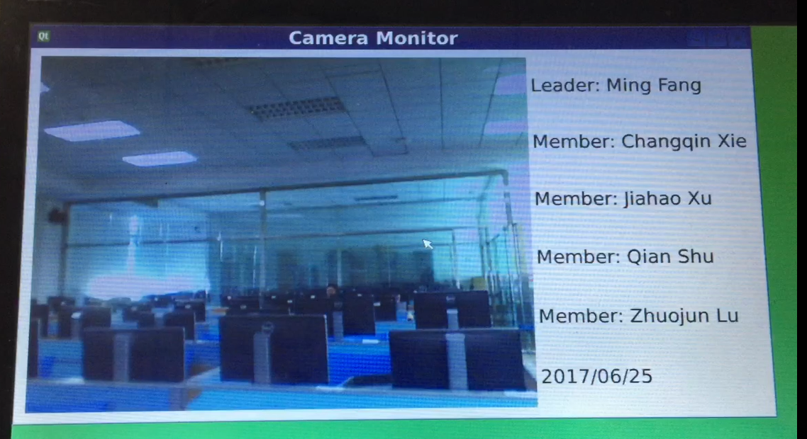

# 2017年《嵌入式操作系统》期末 project 设计报告

### 第一章 项目概述


1. 目标：定制和移植s4418平台上的最小 Linux 内核与文件系统。在最小系统的基础上，加入USB摄像头，用QT编写界面，实现一个利用USB摄像头进行实时监控的简单系统。根据需求，内核需要有基本的功能与 USB 驱动，文件系统也要加上QT环境。
2. 已完成的功能：内核和文件系统可以成功编译制作，安装到s4418平台上后可以正常启动；USB摄像头可以被正常驱动、识别；使用了QT设计GUI，摄像头拍摄到的画面可以成功显示在板子的屏幕上。
3. 测试的效果：插入USB摄像头后，\dev目录下会出现video9设备，UVC 驱动识别到摄像头插入，在终端上显示：uvcvideo: Found UVC 1.00 device (046d:08c5)。通过手动移动摄像头，屏幕上显示的画面也在移动，画面有一定时延，，满足监控需求。

### 第二章 项目人员组成及分工
| 人员 | 分工 | 占比 |
| ----- | ------ | --- | 
| 方铭 | 添加UVC驱动至内核，文件系统移植QT，调试摄像头 | 0% |
| 徐佳豪 |  | 0% | 
| 舒倩 | 最小内核与文件系统的裁剪与编译 | 0% |
| 谢昌秦 | 调试摄像头，QT图形化界面的代码编写与调试 | 0% |
| 卢卓君 |  | 0% |

### 第三章 项目效果




根据图片，可以看出，摄像头拍摄到的图像都显示在了屏幕上；移动的过程中，图像也在跟着移动，实时监控功能已经实现了。为了让屏幕布局更好看，在显示图像的边框右边，加上了一些QT编写的界面，虽然内容比较简单，但也算是完成了图形化界面的设计。对于最小内核的文件系统的裁剪，无法形象的体现出来，只有通过编译后的文件大小来说明。开发板能正常烧写和运行，说明没有裁剪掉实时监控系统所需要的内核模块和系统程序。


### 第四章 项目开发过程
1. Linux内核裁剪

    `
    make menuconfig 
    `
    
    使用空格键进行选取。在每一个选项前都有一个括号，有的是中括号有的是尖括号，还有圆括号。用空格键选择时可以发现，中括号里要么是空，要么是"*"，
    而尖括号里可以是空，"*"和"M"这表示前者对应的项要么不要，要么编译到内核里；后者则多一样选择，可以编译成模块。而圆括号的内容是要你在所提供的几个选项中选择一项。

    裁剪掉的部分：
    
    IRQ subsystem：Support sparse irq numbering (中断子系统中支持稀有的中断编号) 用不上稀有中断，裁剪掉；

    Namespaces support (命名空间支持) 系统不需要使用用户名，所以不需要命名空间服务；

    Kprobes (内核调试) 非开发人员，所以不选

    GCOV-based kernel profiling:Enable gcov-based kernel profiling
    不知道什么意思，所以不选

    Forced module unloading (允许强制卸载正在使用中的模块) 非开发者，所以这个功能不需要

    Support for extended (non-PC) x86 platforms  不涉及系统位数，不选

    RDC R-321x SoC 嵌入式相关，不选 

    Support non-standard 32-bit SMP architectures 非标准的32位SMP结构支持，不选 

    Eurobraille/Iris poweroff module 用于urobraille的iris机子，不选

    Memtest 内核增加一个“memtest”（内核测试）的参数，用不到

    Generic x86 support 针对x86系列的CPU使用更多的常规优化，用不上

    SMT (Hyperthreading) scheduler support 支持Intel的超线程(HT)技术超线程调度器在某些情况下将会对 Intel Pentium 4 HT系列有较好的支持，与实验设备无关，不选

    Multi-core scheduler support 多核优化调度，没什么用途，不选

    Enable X86 board specific fixups for reboot 修复重启bug，现在的板子没有这种问题，不选；

    Math emulation 数学协处理器仿真，CPU够用了，不选；

    Enable seccomp to safely compute untrusted bytecode 嵌入式系统可以不选 

    kexec system call(kexec 系统调用) 用来关闭你当前内核，然后开启另一个内核的系统调用，垃圾功能，不选；

    kernel crash dumps 内核崩溃时，dump运行时信息。看到了运行时信息也不知道怎么解决，所以不选；

    Build a relocatable kernel 建立一个移动的内核，并增加10% 的内核尺寸，运行时会被丢弃，没实质性的作用 

    Compat VDSO support 不选可以移除高阶的VDSO映射，使用随机的VDSO；

    Built-in kernel command line 建立内核命令行，用的是用户层面的命令行，内核的用不上，所以不选；

    Enable CPUfreq debugging 调试CPU频率，没本事改BIOS，所以不选；

    Read CNB20LE Host Bridge Windows 没有公共规范的芯片组，此功能已知是不完整的，要它何用？

    Amateur Radio support 没有用到无线电 

    Wireless， Wireless LAN 实验没有使用无线网卡 

    RF switch subsystem support  没有RF切换设备 

    Managed device resources verbose debug messages 管理设备资源的冗长调试信息，我不需要 

    Ethernet (10000 Mbit)  实验室基金有限，用不起万M卡；  

    FDDI driver support 光纤卡驱动，实验室太穷，用不起光纤；

    Token Ring driver support IBM的令牌环网，用的是以太网(好像根本不用上网)；

    Polled input device skeleton 一种周期性轮询硬件状态的驱动，去掉后没什么副作用  

    Joysticks/Gamepads 游戏设备  

    Miscellaneous devices 杂七杂八的驱动，扬声器，笔记本扩展按键等  

    /dev /kmem virtual device support  支持/dev /kmem 设备，很少用

    Non-standard serial port support  没有非标准的串口设备

    8250/16550 and compatible serial support 兼容一些老式的串口设备，一般不用  

    AMD HW Random Number Generator support, AMD Geode HW Random Number Generator support, VIA HW Random Number Generator support 用的是intel 主板     

    /dev /nvram support  直接存取CMOS ，太危险，关    

    Sound card support 用不到声卡 

    HID Devices  用不到人力工程学设备 

    X86 Platform Specific Device Drivers  一些笔记本的驱动，没有相关设备 

    Remote debugging over FireWire early on boot 启动过程中，允许远程调试内核，用不上这么难的操作

    Security options  安全特性，全关，这些选项不会影响日常开发和办公

    Virtualization 虚拟化，暂时不需要在板子上装虚拟机，不选；

    ```
    make clean
    make dep
    make zImage  
    make install  
    ```

2. 最小文件系统制作
    ```
    |-- bin  
    |   |-- busybox  
    |   '-- sh -> busybox  
    |-- dev  
    |   '-- console  
    |-- etc  
    |   '-- init.d  
    |       '-- rcS  
    '-- lib  
        |-- ld-2.3.2.so  
        |-- ld-linux.so.2 -> ld-2.3.2.so  
        |-- libc-2.3.2.so  
        '-- libc.so.6 -> libc-2.3.2.so 
    ```
    这个最小根文件系统例子只有5个目录，共8个文件。这个极小的根文件系统可以实现系统引导，并通过串行控制台为用户提供一个功能完整的命令行提示，用户可以使用busybox 中启用的任意命令。

    从/bin目录开始看，在其下面已经有了可执行的busybox文件和指向busybox的软链接（soft link）sh，你一会儿就会明白这样做的必要性。/dev目录下的文件是打开一个控制台进行输入/输出所需要的设备节点（device node） 。/etc/init.d目录下的rcS文件是由busybox启动时处理的默认的初始化脚本文件，尽管该文件并不是必需的。使用rcS文件之后就不会出现busybox发出的警告信息，该警告信息只会在rcS文件缺失的时候才出现。

    上述根文件系统必需的最后一个目录项及两个文件是两个库：GLIBC（libc-2.3.2.so）库和Linux动态加载器（ld-2.3.2.so）。GLIBC包括C标准库函数（如printf()）以及绝大多数应用程序所依赖的其他大量库函数；Linux动态加载器用于将二进制可执行文件加载到内存中，并且执行应用程序引用所需共享库函数的链接工作。这里包括的两个软链接是指向ld-2.3.2.so的ld-linux.so.2和指向libc-2.3.2.so的libc.so.6，这些链接使这些共享库不受版本影响并且具有向后兼容的特性，在所有Linux系统下都能看到这类链接。

    本次实验并不需要用到busybox的所有命令行功能，所以可以根据需求进一步裁剪。

    busybox中，Busybox Settings， Init Utilities，Shells，
    Coreutiles不可裁剪，其余的都可以删掉；同时也可以对Coreutils执行进一步的裁剪。本次实验理论上用不到任何与命令行有关的操作，只需要执行一个编译c++代码后生成的可执行文件就可以了。所以将Coreutiles中所有命令设置为n也可以满足要求。但是为了调试方便，保留了cd和ls的命令。

    这个根文件系统已经可以实现基本的c和c++代码的编译和链接，只需要再加上一个QT的库，就可以用QT来实现一个图形化界面。
    

3. usb摄像头的调用


4. QT界面的编写


### 第五章 项目总结

